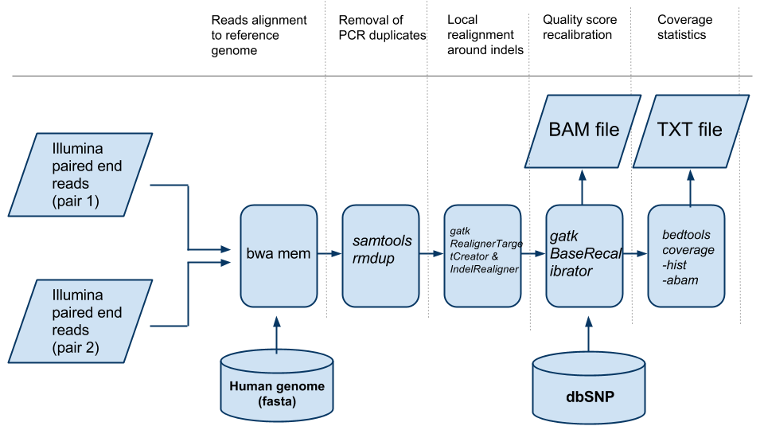

# Illumina exome sequencing reads mapping scons pipeline

A scons based pipeline for mapping Illumina paired end reads obtained from exome sequencing to the human genome.

<p align="center">
  
</p>

### Software Dependencies:
* [scons](http://scons.org/)
* [bwa](http://bio-bwa.sourceforge.net/)
* [samtools](http://www.htslib.org/)
* [Genome Analysis Toolkit](https://software.broadinstitute.org/gatk/)
* [bedtools](http://bedtools.readthedocs.io/)


### Annotation dependencies:

A directory specified by the referenceDir argument containing the following files:

* fasta file of the reference human genome (e.g. reference.fa)

* index of the human reference genome fasta file. It can be generated by the command `samtools faidx reference.fa`

* reference.dict file generated by the command `java -jar CreateSequenceDictionary.jar R=reference.fasta O=reference.dict ` 

* bwa index of the reference genome obtained by the command `bwa index reference.fa`. It produces a bunch of files with the following extensions: .amb .ann .bwt .pac .sa.

An annotation directory specified by the annotationDir argument containing the following file:

* the dbSNP vcf and the vcf index e.g. All_20151104.vcf.idx.

* the .bed file with the exome targeted regions. 


### Running the pipeline:


1. Copy SConstruct, settings.py and sam_remove_soft_clipping.py to the directory where the analysis will be run.

2. Parameters can be set editing the settings.py file or specifiying arguments to scons. In this case parameters from the settings.py file will be ovverriden, see examples below.

2. To start an analysis just launch the scons command from the directory containing the SConstruct file. 


### Examples:

```bash

#Launch the pipeline using all parameters from the settings.py file
scon

#Explicitly specify the directory containing the fasta file of the reference genome
scons referenceDir=~/reference

#Explicitly specify 3 parameters
scons referenceDir=~/reference gatkJarDir=~/local/GATK sampleName=patient1

```


### List of parameters:

| Argument Name        | Description| Type |
| ------------- |:-------------| :-------------|
| reference      | The fasta file with the human genome| String |
| referenceDir | Path to the directory containing the reference sequence (e.g. ~/genome ) | String |
| reads1 & reads2 | The the name of the fastq files containing the paired end reads | String |
| annotationDir | Path to the directory with annotation files (e.g. ~/annotation ) | String |
| exomeRegions| The bed file with exome caputered regions. This file must be located in the annotaion directory | String |
| gatkJarDir | The path to the directory to containing the GenomeAnalysisTK.jar file | String |
| dbsnpVCF | The name of the vcf file downloaded from dbSNP database | String |
| projectName |  A name for the project | String |
| sampleName | The sample's name | String |
| processors | Number of CPUs to be used | Int |
| maxMemory | Max memory to be used (in bytes) | Int |
| removeNs | If Ns if should trim flanking Ns from reads | String (y/n) |
| removeSoftClipped | If soft clipped reads should be removed from bam file' | String (y/n) |


### Results:

The pipeline will produce a bam file called *mapping-sorted-rmdup-realigned-recal.bam* and a file called *coverage-hist.txt* with coverage statistics containing the following columns:

1. A first column containing only the word all, it derives from the bedtools command used to produce the file.

2. The coverage level.

3. Number of bases with the coverage level indicated by the previous column.

4. The total number of bases targeted by the exome sequencing.

5. The fraction of bases with coverage equal to the one indicated in column 2
