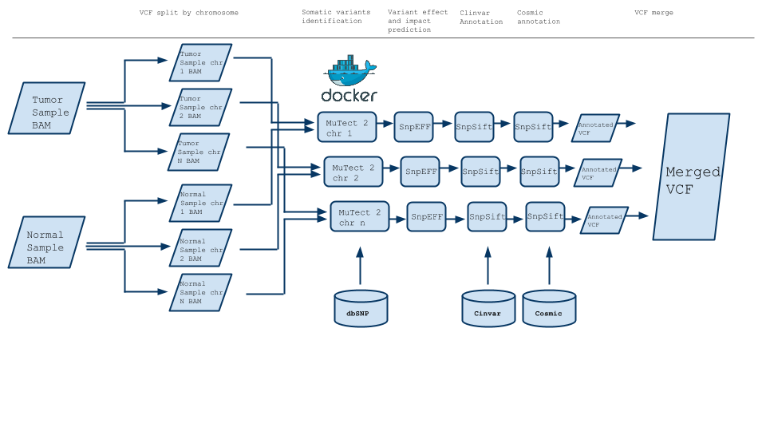

# Somatic variants identification with MuTect 2, bam splitted by chromosome

A scons based pipeline for mapping somatic variants identification using MuTect2. Original BAM files is splitted by chromosome to parallelize the process.

### Software Dependencies:
* [scons](http://scons.org/)
* [SnpEff](http://snpeff.sourceforge.net/)

### Annotation dependencies:

An annotation directory specified by the annotationDir argument containing the following file:

* the dbSNP vcf and the vcf index e.g. All_20151104.vcf.idx.

* clinvar vcf and clinvar vcf.tbi file

* cosmic coding variants vcf and vcf.tbi file

* cosmic non coding variants vcf and vcf.tbi file

A directory specified by the referenceDir argument containing the following files:

* fasta file of the reference human genome (e.g. reference.fa)

* index of the human reference genome fasta file. It can be generated by the command `samtools faidx reference.fa`

* reference.dict file generated by the command `java -jar CreateSequenceDictionary.jar R=reference.fasta O=reference.dict ` 

### Running the pipeline:

### Examples:

### List of parameters:

### Results:
